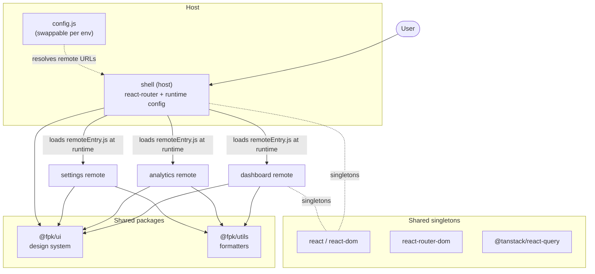

# FPK — Frontend Platform Kit

A production-grade **micro-frontend platform** built as a monorepo: a shell host
that composes three independently deployable remotes at **runtime** via Webpack 5
Module Federation, backed by a shared design system and shared utilities.

[](https://github.com/viren-ahire-1999/fpk/actions/workflows/ci.yml)
[](https://github.com/viren-ahire-1999/fpk/actions/workflows/deploy.yml)
[](./LICENSE)

**🚀 Live demo:** https://fpk-shell.pages.dev &nbsp;·&nbsp; **📚 Storybook:** https://fpk-storybook.pages.dev

> Each remote is its own Cloudflare Pages deployment on its own origin. The shell
> discovers them at runtime from a swappable `config.js` — change one URL, no rebuild.

---

## Why this exists

Large frontend orgs need teams to ship independently without stepping on each
other. This project demonstrates the architecture that makes that possible:

- **Independent deploys** — each remote ships on its own cadence to its own URL.
- **Runtime composition** — the host loads remotes at runtime, not build time, so
  one shell artifact runs against any environment.
- **Clear ownership boundaries** — `apps/*` are deployables, `packages/*` are
  shared libraries with versioned contracts.
- **Shared singletons** — React, Router, and TanStack Query are shared once across
  every remote to avoid duplication and context mismatches.

## Architecture



## Tech stack

| Concern | Choice |
| --- | --- |
| Monorepo | pnpm workspaces + Turborepo |
| Micro-frontends | Webpack 5 Module Federation (runtime remotes) |
| UI / routing / data | React 18, React Router, TanStack Query |
| Design system | `@fpk/ui` (tsup build) + Storybook |
| Language / quality | TypeScript (strict), ESLint (flat config), Vitest |
| Hosting / CI | Cloudflare Pages + GitHub Actions |

## Repository layout

```
fpk/
├── apps/
│   ├── shell/        # host: composes remotes, runtime config, error boundaries
│   ├── dashboard/    # remote: metrics overview + reports (nested routes)
│   ├── analytics/    # remote: range-filtered chart
│   └── settings/     # remote: profile form + members table
├── packages/
│   ├── ui/           # @fpk/ui design system (Storybook + Vitest)
│   ├── utils/        # @fpk/utils formatters
│   ├── tsconfig/     # shared TS presets
│   └── eslint-config/# shared flat ESLint config
└── .github/workflows/{ci,deploy}.yml
```

## Local development

```bash
pnpm install
pnpm dev        # starts shell :3000 + remotes :3001/:3002/:3003
```

Open http://localhost:3000. Each remote also runs standalone (e.g. http://localhost:3001).

```bash
pnpm build      # build all (Turborepo, cached)
pnpm typecheck
pnpm lint
pnpm test
```

## How runtime composition works

The shell has **no remote URLs baked into its bundle**. At startup it reads
`window.__FPK_CONFIG__` from `config.js` (a static asset loaded before the app),
then dynamically loads each remote's `remoteEntry.js`, initializes the shared
scope, and renders the exposed module — wrapped in a `Suspense` + error boundary
so a single unavailable remote never blanks the app.

```
apps/shell/public/config.js              # local dev (localhost remotes)
apps/shell/public/config.production.js   # production (pages.dev remotes)
```

## Deployment (Cloudflare Pages, free)

Each app deploys independently via GitHub Actions on push to `main`.

**One-time setup:**

1. Create 5 Cloudflare Pages projects (Direct Upload):
   `fpk-shell`, `fpk-dashboard`, `fpk-analytics`, `fpk-settings`, `fpk-storybook`.
2. Add repo secrets: `CLOUDFLARE_API_TOKEN` (Pages: Edit) and `CLOUDFLARE_ACCOUNT_ID`.
3. If any `*.pages.dev` name is taken, adjust the project name in
   `.github/workflows/deploy.yml` **and** the matching URL in
   `apps/shell/public/config.production.js`.

On deploy, the workflow swaps in the production `config.js` and CORS `_headers`,
then uploads each `dist/` to its project. Remotes serve
`Access-Control-Allow-Origin: *` so the host can pull their federated assets
cross-origin.

## License

[MIT](./LICENSE)
